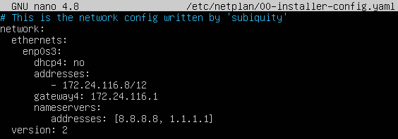
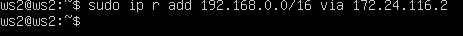

## Part 1. ipcalc tool

1. Network address of 192.167.38.54/13:

   Network address is 192.160.0.0/13 (11000000.10100 000.00000000.00000000)

2. Conversion of the mask 255.255.255.0 to prefix and binary:

   prefix - /24

   binary - 11111111.11111111.11111111. 00000000

3. Conversion of /15 to normal and binary:

   normal - 255.254.0.0

   binary - 11111111.11111110.00000000. 00000000

4. Conversion 11111111.11111111.11111111.11110000 to normal and prefix:

   normal - 255.255.255.240

   prefix - /28

5. Minimum and maximum host in 12.167.38.4/8:

   HostMin - 12.0.0.1

   HostMax - 12.255.255.254

6. Minimum and maximum host in 12.167.38.4/11111111.11111111.00000000.00000000:

   HostMin - 12.167.0.1

   HostMax - 12.167.255.254

7. Minimum and maximum host in 12.167.38.4/255.255.254.0:

   HostMin - 12.167.38.1

   HostMax - 12.167.39.254

8. Minimum and maximum host in 12.167.38.4/4:

   HostMin - 0.0.0.1

   HostMax - 15.255.255.254

9. An application running on localhost can be accessed with the following IPs:

   194.34.23.100 - no

   127.0.0.2 - yes

   127.1.0.1 - yes

   128.0.0.1 - no

10. IPs can be used as

   10.0.0.45 - private

   134.43.0.2 - public

   192.168.4.2 - private

   172.20.250.4 - private

   172.0.2.1 - public

   192.172.0.1 - public

   172.68.0.2 - public

   172.16.255.255 - private

   10.10.10.10 - private

   192.169.168.1 - public

11. Gateway IP addresses are possible for 10.10.0.0/18:

   10.0.0.1 - no

   10.10.0.2 - yes

   10.10.10.10 - yes

   10.10.100.1 - no

   10.10.1.255 - yes

## Part 2. Static routing between two machines

1. Network interfaces ws1

   

2. Network interfaces ws2

   

3. The network interface corresponding to the internal network is enp0s3 on both machines

4. Set the following address and mask on ws1: 192.168.100.10/16

   

5. Set the following address and mask on ws2: 172.24.116.8/12

   

6. Output of the command `netplan apply` on ws1

   

7. Output of the command `netplan apply` on ws2

   

8. Static route from one machine to another on ws1

   

9. Static route from one machine to another on ws2 

   

10. Add address of ws2 to ws1

   

11. Add address of ws1 to ws2

   

12. Ping ws2 from ws1

   

13. Ping ws1 from ws2

   

14. Static route from ws1 to ws2 

   

15. Static route from ws2 to ws1

   

16. Ping ws2 from ws1

   

17. Ping ws1 from ws2

   

## Part 3. iperf3 utility

1. 8 Mbps = 0.9766 MB/s

2. 100 MB/s = 838861 Kbps

3. 1 Gbps = 1000 Mbps

4. Connection speed between ws1 and ws2 (ws1 - server, ws2 - client)

   

   

   Bitrate ws1 - 2.81 Gbits/sec (reciever)

   Bitrate ws2 - 2.55 Gbits/sec (sender)

5. Connection speed between ws2 and ws1 (ws2 - server, ws1 - client)

   

   

   Bitrate ws1 - 2.69 Gbits/sec (sender)

   Bitrate ws2 - 2.83 Gbits/sec (receiver)

## Part 4. Network firewall

1. Content of file /etc/firewall.sh on ws1

   

2. Content of file /etc/firewall.sh on ws2

   

3. Run the file on ws1

   

4. Run the file on ws2

   

5. The difference between the strategies used on ws1 and ws2 is:

   1) We can ping ws2 from ws1. Because an allow rule wasn't cancelled.

   2) We can't ping ws1 from ws2. Because, a deny rule wasn't cancelled.

   3) The first rule will be worked in both cases.

6. We can ping ws2

   

7. We can't ping ws1

   

8. The machine host is up

   

## Part 5. Static network routing

1. The ws11 machine configuration:

   

2. The ws21 machine configuration:

   

3. The ws22 machine configuration:

   

4. The r1 machine configuration:

   

5. The r2 machine configuration:

   

6. Restart the network service of ws11:

   

7. Restart the network service of ws21:

   

8. Restart the network service of ws22:

   

9. Restart the network service of r1:

   

10. Restart the network service of r2:

   

11. The `ip -4 a` command on ws11:

   

12. The `ip -4 a` command on ws21:

   

13. The `ip -4 a` command on ws22:

   

14. The `ip -4 a` command on r1:

   

15. The `ip -4 a` command on r2:

   

16. Ping ws22 from ws21

   

17. Ping r1 from ws11

   

18. Enable IP forwarding on r1

   

19. Enable IP forwarding on r2

   

20. Changed `/etc/sysctl.conf` file on r1:

   

21. Changed `/etc/sysctl.conf` file on r2:

   

22. I added the default route (gateway) earlier, so you can see screenshots at the beginning of Part 5

23. Output of `ip r` command on ws11:

   

24. Output of `ip r` command on ws21:

   

25. Output of `ip r` command on ws22:

   

26. Ping r2 from ws11

   

27. Output of the `sudo tcpdump -tn -i enp0s3` command

   

28. I added static routes to r1 and r2 configuration files earlier. You can see screenshots above.

29. Output of command `ip r` on r1

   

30. Output of command `ip r` on r2

   

31. Output of command `ip r list 10.10.0.0/18` 

   

32. Output of command `ip r list 0.0.0.0/0`

   

33. In the case with the address 0.0.0.0/0 output of command is the address of this machine (ws11). Because this

   address will be works in any cases even if the network wouldn't work. In case with the address 10.10.0.0/18 we have

   define gateway, which address we can see in the output. 

34. Output of `traceroute 10.0.20.10` command

   

35. Output of `tcpdump -tnv -i enp0s3` command

   

36. Traceroute send series of packages to specified address. Every time increase TTL (time of package life) for 1. TTL

   usually is a number of gateways on the path between the machine and specified address.

37. Ping a non-existent IP from ws 11

   

38. Traffic capture on r1 going through enp0s3

   

## Part 6. Dynamic IP configuration using DHCP

1. Changed file `/etc/dhcp/dhcpd.conf` on r2

   

2. Changed file `/etc/resolv.conf` on r2

   

3. Restart the DHCP service on r2

   

4. The output of `ip a` command on ws21

   

5. Ping ws22 from ws21

   

6. Changed `/etc/netplan/00-installer-config.yaml` file on ws11

   

7. Changed `/etc/dhcp/dhcpd.conf` file on r1

   

8. Changed `/etc/resolf.conf` file on r1

   

9. The output of the command `systemctl restart isc-dhcp-server`

   

10. The output of the command `ip a` on ws11

   

11. Ping ws22 from ws11

   

12. IP on ws21 before changes

   

13. IP on ws21 after changes

   

14. To get new IP address I use command `dhclient` and `dhclient -r`. We release the old IP address using flag `-r` and

   asking the new IP address with command `dhclient`.

## Part 7. NAT

1. Changed file `/etc/apache2/ports.conf` on ws22

   

2. Changed file `/etc/apache2/ports.conf` on r1

   

3. Start the Apache web server on ws22

   

4. Start the Apache web server on r1

   

5. Ping r1 from ws22 after creating firewall.sh

   

6. Ping r1 from ws22 after changing firewall.sh

   

7. File containing our firewall settings on r2

   

8. Check the TCP connection from ws22 to r1

   

9. Check the TCP connection from r1 to ws22

   
